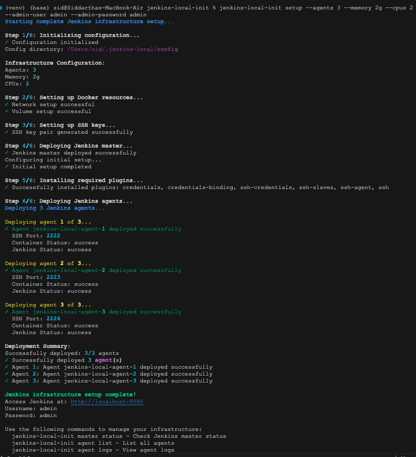

# Jenkins Local Init

A tool for setting up and managing a local Distributed Jenkins Infrastructure with Docker.

## Features

- Automated setup of Jenkins master and agents
- Docker network and volume management
- SSH key generation and management
- Jenkins plugin installation
- Agent deployment and management

## Quick Start

Set up a complete Jenkins infrastructure with a single command:

```bash
jenkins-local-init setup --agents 3 --memory 2g --cpus 2
```

This will:
1. Initialize configuration directories
2. Set up Docker network and volume
3. Generate SSH keys
4. Deploy Jenkins master
5. Install required plugins (credentials, ssh, etc.)
6. Deploy Jenkins agents

## Detailed Usage

### Complete Setup

```bash
jenkins-local-init setup [OPTIONS]
```

Options:
- `--agents INTEGER`: Number of Jenkins agents to create (default: 1)
- `--memory TEXT`: Memory allocation for agents (default: 4g)
- `--cpus INTEGER`: Number of CPUs for agents (default: 2)
- `--admin-user TEXT`: Jenkins admin username (default: admin)
- `--admin-password TEXT`: Jenkins admin password (default: admin)

### Individual Commands

If you prefer to set up the infrastructure step by step, you can use the following commands:

#### Docker Resources

```bash
# Initialize network and volume
jenkins-local-init docker init
```

#### SSH Keys

```bash
# Generate SSH keys
jenkins-local-init ssh generate

# Show public key
jenkins-local-init ssh show
```

#### Jenkins Master

```bash
# Deploy master
jenkins-local-init master deploy --admin-user admin --admin-password admin

# Check status
jenkins-local-init master status

# Control master (start/stop/restart)
jenkins-local-init master control start|stop|restart
```

#### Jenkins Agents

```bash
# Deploy agents
jenkins-local-init agent deploy --count 3 --admin-user admin --admin-password admin

# List agents
jenkins-local-init agent list

# View agent logs
jenkins-local-init agent logs

# Remove specific agent
jenkins-local-init agent remove INDEX

# Remove all agents
jenkins-local-init agent remove-all
```

## Plugins

The setup command automatically installs the following plugins:

- Credentials Plugin
- Credentials Binding Plugin
- SSH Credentials Plugin
- SSH Slaves Plugin
- SSH Agent Plugin
- SSH Plugin

## Requirements

- Docker
- Python 3.6+
- Required Python packages (see requirements.txt)
