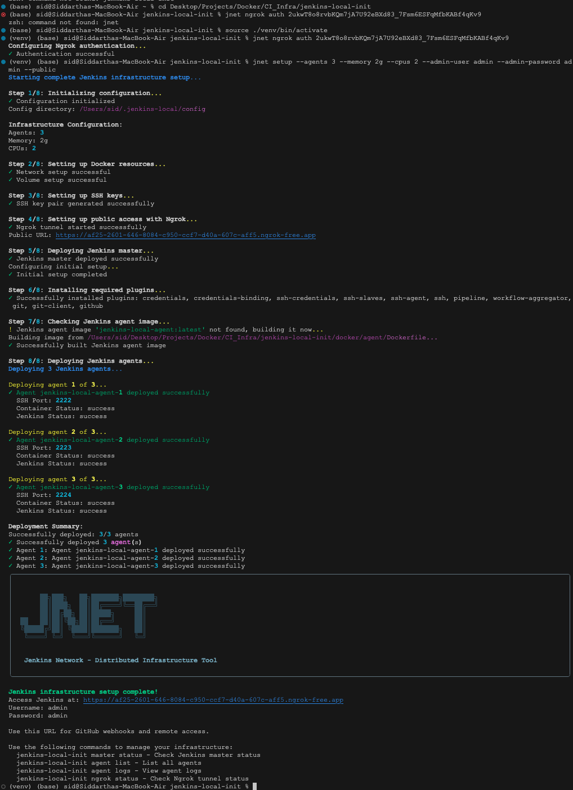

# Jenkins Local Init

A tool for setting up and managing a local Distributed Jenkins Infrastructure with Docker.

## Features

- Automated setup of Jenkins master and agents
- Docker network and volume management
- SSH key generation and management
- Jenkins plugin installation
- Agent deployment and management

## Prerequisites

Before using this tool, make sure you have the following installed:

- **Docker**: Required for creating and managing containers
  - [Install Docker](https://docs.docker.com/get-docker/)
- **Python 3.6+**: Required to run the CLI tool
  - [Install Python](https://www.python.org/downloads/)
- **Git**: Required for cloning the repository
  - [Install Git](https://git-scm.com/downloads)

## Installation

### Option 1: Install from GitHub

```bash
# Clone the repository
git clone https://github.com/Siddartha-Kodaboina/jenkins-local-init.git
cd jenkins-local-init

# Create a virtual environment
python -m venv venv

# Activate the virtual environment
# On macOS/Linux:
source venv/bin/activate
# On Windows:
# venv\Scripts\activate

# Install dependencies
pip install -r requirements.txt

# Install the package in development mode
pip install -e .
```

### Option 2: Use without installation

If you prefer not to install the package, you can run it directly using the Python module:

```bash
# Clone the repository
git clone https://github.com/Siddartha-Kodaboina/jenkins-local-init.git
cd jenkins-local-init

# Create a virtual environment
python -m venv venv

# Activate the virtual environment
# On macOS/Linux:
source venv/bin/activate
# On Windows:
# venv\Scripts\activate

# Install dependencies
pip install -r requirements.txt

# Run commands using the Python module
python -m jenkins_local_init.cli.main [COMMAND]
```

## Quick Start

Set up a complete Jenkins infrastructure with a single command:

```bash
# If installed as a package:
jenkins-local-init setup --agents 3 --memory 2g --cpus 2 --admin-user admin --admin-password admin

# If running as a module:
python -m jenkins_local_init.cli.main setup --agents 3 --memory 2g --cpus 2 --admin-user admin --admin-password admin
```

This will:
1. Initialize configuration directories
2. Set up Docker network and volume
3. Generate SSH keys
4. Deploy Jenkins master
5. Install required plugins (credentials, ssh, etc.)
6. Deploy Jenkins agents

## Detailed Usage

### Complete Setup

```bash
# If installed as a package:
jenkins-local-init setup [OPTIONS]

# If running as a module:
python -m jenkins_local_init.cli.main setup [OPTIONS]
```

Options:
- `--agents INTEGER`: Number of Jenkins agents to create (default: 1)
- `--memory TEXT`: Memory allocation for agents (default: 4g)
- `--cpus INTEGER`: Number of CPUs for agents (default: 2)
- `--admin-user TEXT`: Jenkins admin username (default: admin)
- `--admin-password TEXT`: Jenkins admin password (default: admin)

### Individual Commands

If you prefer to set up the infrastructure step by step, you can use the following commands. For brevity, we'll show the commands using the installed package format, but you can also use the module format (`python -m jenkins_local_init.cli.main`) for all commands.

#### Docker Resources

```bash
# Initialize network and volume
jenkins-local-init docker init

# Check Docker resources
docker network ls | grep jenkins-local-net
docker volume ls | grep jenkins-local-data
```

#### SSH Keys

```bash
# Generate SSH keys
jenkins-local-init ssh generate

# Show public key
jenkins-local-init ssh show

# Backup existing SSH keys
jenkins-local-init ssh backup
```

#### Jenkins Master

```bash
# Deploy master
jenkins-local-init master deploy --admin-user admin --admin-password admin

# Check status
jenkins-local-init master status

# Control master (start/stop/restart)
jenkins-local-init master control start|stop|restart

# View master logs
jenkins-local-init master logs
```

#### Jenkins Agents

```bash
# Deploy agents
jenkins-local-init agent deploy --count 3 --admin-user admin --admin-password admin

# List agents
jenkins-local-init agent list

# View agent logs
jenkins-local-init agent logs

# Remove specific agent
jenkins-local-init agent remove INDEX

# Remove all agents
jenkins-local-init agent remove-all
```

## Command Reference

Here's a complete reference of all available commands:

### Global Commands

- `setup`: Set up complete Jenkins infrastructure
- `status`: Check the status of Jenkins infrastructure

### Docker Commands

- `docker init`: Initialize Docker network and volume

### SSH Commands

- `ssh generate`: Generate SSH key pair for Jenkins agents
- `ssh show`: Display the public key
- `ssh backup`: Backup existing SSH keys

### Master Commands

- `master deploy`: Deploy Jenkins master container
- `master status`: Check Jenkins master status
- `master control`: Control Jenkins master container (start/stop/restart)
- `master logs`: View Jenkins master logs

### Agent Commands

- `agent deploy`: Deploy Jenkins agent containers
- `agent list`: List all Jenkins agents
- `agent logs`: Show logs for all agents
- `agent remove`: Remove a specific agent
- `agent remove-all`: Remove all Jenkins agents

## Plugins

The setup command automatically installs the following plugins:

- Credentials Plugin
- Credentials Binding Plugin
- SSH Credentials Plugin
- SSH Slaves Plugin
- SSH Agent Plugin
- SSH Plugin

## Troubleshooting

### Common Issues

1. **Docker daemon not running**
   - Error: `Error: Docker daemon is not running`
   - Solution: Start Docker daemon and try again

2. **Port conflicts**
   - Error: `Error: Port 8080 is already in use`
   - Solution: Stop any services using port 8080 or specify a different port with `--port`

3. **SSH key generation fails**
   - Error: `Failed to generate SSH keys`
   - Solution: Check permissions on the ~/.jenkins-local directory

4. **Jenkins master deployment fails**
   - Error: `Failed to deploy Jenkins master`
   - Solution: Check Docker logs and ensure Docker has enough resources

5. **Plugin installation fails**
   - Error: `Failed to install plugins`
   - Solution: Check Jenkins logs and ensure Jenkins has internet access

### Getting Help

To get help for any command, use the `--help` flag:

```bash
jenkins-local-init --help
jenkins-local-init setup --help
jenkins-local-init agent deploy --help
```

## Directory Structure

The tool creates the following directory structure in your home directory:

```
~/.jenkins-local/
├── config/           # Configuration files
├── logs/             # Log files
├── ssh/              # SSH keys
│   ├── jenkins_agent     # Private key
│   └── jenkins_agent.pub # Public key
└── backups/          # Backup files
```

## Contributing

Contributions are welcome! Please feel free to submit a Pull Request.
